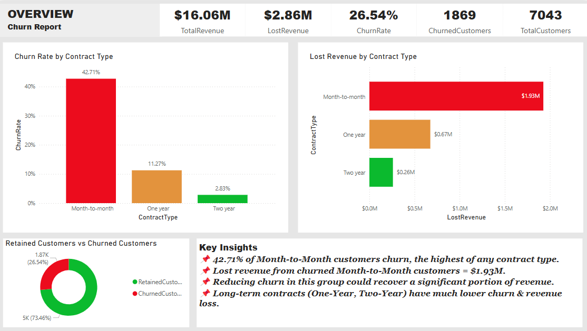
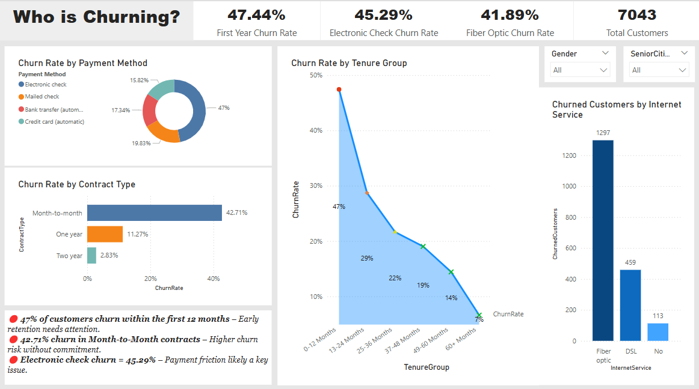
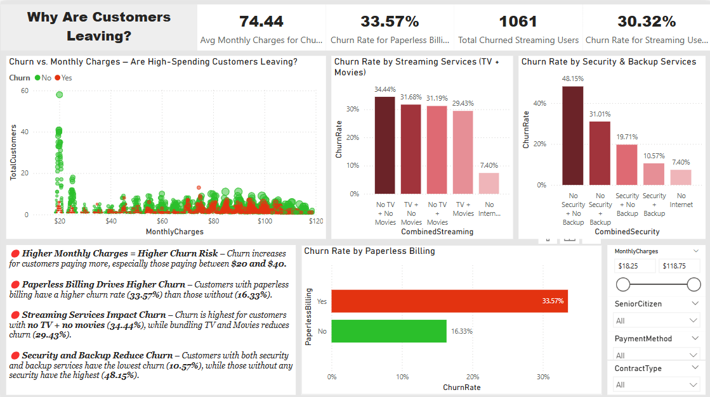

# Customer Churn Analysis Using SQL & Power BI
**Business Challenge**: A comprehensive analysis of Telco's data (a fictitious telecommunications company) to understand the main factors causing customer churn and identify actionable insights to reduce churn, retain customers, and recover lost revenue.

## Introduction
This project analyses customer churn for a telecommunications company using **SQL** for data querying and analysis, and **Power BI** for visualisation. The goal is to find out the causes of churn, measure the financial impact of losing customers, and figure out high-risk customer segments for better customer retention.

Customer churn is a serious issue in business. If customers are leaving a business or company, their revenue and profitability are negatively affected. How do factors like age, contract type, monthly charges, payment methods, internet service, tenure, and more, affect customer retention at Telco telecoms? Let's find out.

## Dataset Description
- **Dataset:** Telco customer churn
- **Dataset Size:** 955 KB
- **Number of Customers:** 7,043
- **Number of Columns:** 21
- **Source:** Kaggle
- **Key Fields:**
  - CustomerID, Gender, SeniorCitizen
  - ContractType, PaperlessBilling, MonthlyCharges, TotalCharges, Tenure
  - StreamingTV, StreamingMovies, OnlineBackup, OnlineSecurity
  - InternetService, PaymentMethod, Churn
 
## Objectives
1. Measure overall customer churn rate.
2. Identify customer segments with the highest churn risk.
3. Understand the financial impact of churn on businesses
4. Figure out patterns in churn based on contract type, payment method, and internet services.
5. Provide insights for improved customer retention and increased revenue.

## Methodology
**1. Data Preparation & Cleaning**
- Downloaded dataset (TelcoData.csv) from Kaggle.
- Imported the TelcoData.csv dataset into SQL Server using the Import Wizard.
- Split the flat file into 5 normalised tables:
    - Customers
    - Contracts
    - Services
    - Billings
    - Churn
2. **Data Analysis using SQL**
- Joined tables to create a single customer view.
- Used CTEs, subqueries, and aggregations to calculate:
    - Overall churn rate
    - Monthly revenue and lost revenue from churn
    - Payment method, internet service, and contract type-based churn rates
    - Tenure-based churn patterns
3. **Data Visualisation using Power BI**
- Created a detailed 3-page dashboard covering:
  - **Overview:** A big picture of the company's financial performance and churn breakdown.  
    
  - **Who is Churning?**: Churn based on contract type, tenure, payment method, and internet service.  
    
  - **Why Are Customers Leaving?**: A deeper look at what's causing customers to leave.  
    
 
## Key Insights
### ✅ High Churn Rate Is a Major Business Risk
- Overall churn rate = 26.54% (approximately 1 in 4 customers are leaving)
- Lost revenue from churn = $2.86M (67% from customers on month-to-month contracts)
- The total customer base is 7,043, but 1,869 customers have been lost to churn. That's more than 25% of customers.

### ✅ Month-to-Month Contracts Are the Largest Churn Driver
- 42.71% churn rate among month-to-month customers — 4x higher than for two-year contracts.
- Lost revenue from month-to-month churn is $1.93M (about 70% of total lost revenue).  
🔎**Insight:** Short contracts make it easier for customers to leave, leading to higher losses.  
📢**What to Do:**
  - Provide discounts to get customers to switch to yearly contracts.
  - Offer loyalty programs & bonuses to encourage customers to sign longer contracts.

### ✅ Customers Are Leaving Early
- 47.44% of customers churn within the first 12 months - early retention is a problem.
- After 24 months, the churn rate drops to 14.04%  
🔎**Insight:** A good experience early on helps keep customers longer.  
📢**What to Do**:
  - Improve customer onboarding and support.
  - Offer rewards for customers who stay past their first year.

### ✅ High Monthly Charges Increase Churn Risk
- Customers paying over $70/month have the highest churn rate (34.36%).
- Medium spenders ($30–$70) churn at 24.35%, while low spenders (<$30) churn at 9.80%.
- Early churn happens most among customers paying between $20-$40.  
🔎**Insight:** Customers with high bills are more likely to seek cheaper alternatives.  
📢**What to Do**
  - Offer discounts or exclusive perks for long-term payments that are consistent.
  - Loyalty bonuses for high-paying customers.
  - Pricing should vary depending on a customer's spending levels.

### ✅ Fiber Optic Customers Are Churning More
- Fiber optic churn rate = 41.89%, nearly double the rate of DSL users (18.96%).
- 82.47% of churned streaming users were fiber optic customers.  
🔎**Insight:** High cost of internet service and service quality issues are likely causing customers to leave.  
📢**What to Do**
  - More affordable fiber optic plans will reduce customers' spend.
  - Improve the internet speed for fiber optic customers.

### ✅ Streaming Services Have an Impact on Churn
- Customers without TV and movies have the highest churn rate at 34.44%.
- Bundling TV and movies reduces churn to 29.43%.
- Customers with both TV and movies tend to have higher lifetime value.  
🔎**Insight**: Bundling streaming helps keep customers longer.  
📢**What to Do**:
  - Offer discounts for bundling TV and movies.
  - Include premium streaming content as part of long-term contracts.
  
### ✅ Paperless Billing Drives Higher Churn
- Customers using paperless billing have a churn rate of 33.57% – double the rate for those who don’t use it (16.33%).
- Over 4,171 customers use paperless billing, and 1,400 of them have churned.  
🔎**Insight:** Paperless billing is convenient but some customers may find it impersonal or risky.  
📢**What to Do**
  - Offer both paper and online billing to make the switch easier.
  - Explain to customers the security and convenience of paperless billing.
  - Provide support to help customers with paperless billing issues.

### ✅ Lack of Security and Backup Increases Churn
- Customers without security and backup services have a churn rate of 48.15% – the highest among all services.
- Customers with both security and backup have the lowest churn rate at 10.57%.  
🔎**Insight:** Offering security and backup services helps keep customers longer.  
📢 **What to Do:**
  - Offer a bundle of security and backup at a lower price.
  - Give customers a free trial of security and backup to encourage them to sign up.

### ✅ Seniors Using Electronic Checks Have a High Churn Rate
- Senior citizens who use electronic checks have a churn rate of 53.37% – the highest of any customer group.
- Over 594 seniors use electronic checks, and 317 of them have churned.  
🔎**Insight:** Seniors may feel less comfortable using digital payments (bank transfers & credit cards) or they may worry about security.  
📢**What to Do:**
  - Encourage seniors to switch to automatic bank transfers or credit cards.
  - Offer direct support to help seniors switch from electronic checks.
  - Give discounts or bill credits for switching payment methods.
  
### ✅ Unbundled Services Have Higher Churn Rates
- Customers with unbundled services churn at 29.71%, compared to 14.85% for bundled services.
- Bundling security, streaming, and internet helps reduce churn.  
🔎**Insight:** Bundling makes customers more likely to stay and increases their value over time.  
📢**What to Do:**
  - Offer deals for bundling internet, streaming, and security.
  - Reward customers who bundle multiple services.

### ✅ Customer Lifetime Value (CLV) Analysis
- Churned customers had a high CLV – up to $8,680 in lost value.
- Customers on long-term contracts had higher CLV but were less likely to churn.  
🔎**Insight:** Losing high CLV customers hurts long-term profits.  
📢**What to Do:**
  - Offer loyalty rewards to high CLV customers.
  - Keep long-term contract customers happy with special perks.

### ✅ Difficulties & Inconvenience with Payment Drives Churn
- Electronic check churn rate = 45.29% – Highest among payment methods.
- Customers using credit cards and bank transfers churn less often.

## Business Impact
💡 $2.86M in lost revenue → Reducing churn among month-to-month customers could recover over $1.93M in lost revenue. Encouraging them to switch to 1 or 2-year contracts could help.  
💡 Fiber optic customers are valuable but at high risk of leaving – improving retention in this group could help keep revenue steady.  
💡 Making payments easier (like setting up auto-pay with credit cards or bank transfers) could reduce churn.  
💡 Lower churn among customers with bundled security and backup shows that better service packages could help keep more customers.

## How to Use This Project
1. **Download the dataset:** The dataset is available in the repo for reproducibility.
2. **Set Up the Database**: Create a new database in SQL Server and load the dataset using the Import Wizard into a staging table (Staging_Telco).
3. **Run the SQL scripts:** Open the SQL script from the repo and execute them to create tables, populate data, and perform analysis.
4. **Open the Power BI Dashboard:** Open the .pbix file in Power BI Desktop and have a look at the dashboards:
- **Overview**: A big picture of the company's financial performance and churn breakdown.
- **Who is Churning**: A deep dive into churn breakdown based on several factors.
- **Why Are Customers Leaving**: Root causes of customer churn at Telco.
5. **Explore Insights:** The dashboard shows key insights and trends. Adjust filters and slicers to uncover patterns.

## Future Work
- Use machine learning to predict churn risk.
- Further analysis on Fiber Optic churn patterns.
- Customer segmentation for targeted retention strategies.
- Python to more deeply analyse the dataset and uncover deeper insights.

## Credits and Acknowledgments
- **Dataset:** Telco Customer Churn Dataset
- **Tools Used:** SQL Server, Power BI
- **Author:** Victor Arum

## Status: COMPLETED
This project is a comprehensive churn analysis that demonstrates deep analytical skills and business-level insights using SQL and Power BI.

## Links
- [Project Repo](https://github.com/Victor-Arum/customer-churn-analysis/)
